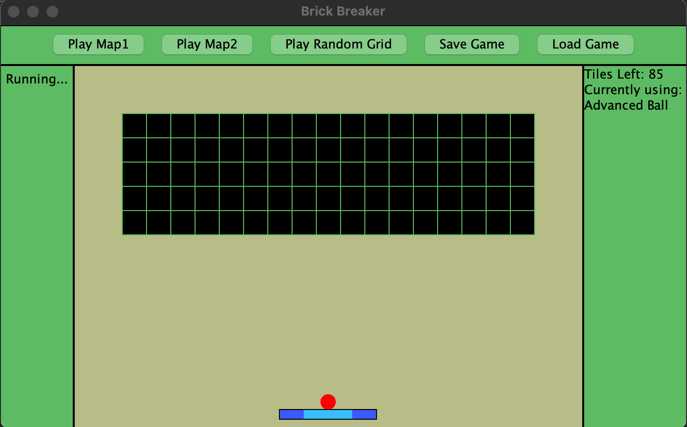

=:=:=:=:=:=:=:=:=:=:=:=:=:=:=:=:=:=:=
CIS 120 Game Project README
=:=:=:=:=:=:=:=:=:=:=:=:=:=:=:=:=:=:=

===================
=: Core Concepts :=
===================

-   List the four core concepts, the features they implement, and why each feature
    is an appropriate use of the concept. Incorporate the feedback you got after
    submitting your proposal.

    I changed the whole game idea (from Pac-man to Brick Breaker), and with that,
    my core concepts changed too.

    1. Collections

    -   a linkedlist stores all the unbroken bricks (Brick Objects) at anypoint while the
        game is being played.

    2. 2D array

    -   a 2D array is used to represent the initial layout of the bricks in the game widow
        (how the bricks are laid out to make a wall) where a 'O' is an empty space and '#'
        is a brick. This 2D array is then read by the GameCourt class to identify the bricks
        and their positions and store them as their respective Brick objects in the brickList
        collection. This is used while generating a random layout of bricks for a game.
    -   A 2D array would was the most suitable to represent a wall of bricks, as a wall is
        like a table with rows and columns, where each of its element is either a brick or an
        empty hole.

    3. File I/O

    -   File Input is used to load pre-designed or saved brick wall layouts into the Game from a text
        file where '0' represents an empty space and '#' represents a brick in the wall.
    -   File output is used to save a specific layout from the layout of the game currently being played
        during the game play.

    4. Inheritance/Dynamic Dispatch

    -   The game uses Dynamic dispatch to define attributes and behaviors of the two different type of balls.
        The GameObject class is extended by an abstract Ball class which has the basic draw and launch
        functions defined, but the bounceOnPaddle is not defined, as the two different types of Balls
        (Advanced and Straight) bounce differently on the paddle. Inheritance makes sense because the Advanced
        ball and the Straight ball are similar in some attributes and behaviors, but differ in others.

=========================
=: Your Implementation :=
=========================

-   Provide an overview of each of the classes in your code, and what their
    function is in the overall game.

    1. Game class : This class defines the frames, JPanels, buttons and Labels for the GUI and has the main method.
    2. GameObj class : This abstract class defines the basic attributes and behaviors of all the objects/elements
       in the game.
    3. Paddle class : This class, extending GameObj, provides the instance for the paddle used in the class.
    4. Ball class : This abstract class defines the common methods and attributes for the ball used in the game.
    5. StraightBall class : This class, extending the Ball class, provides the instance for the StraightBall used in the
       game after defining its color and the abstract method bounceOnPaddle.
    6. AdvancedBall class : This class, extending the Ball class, provides the instance for the AdvancedBall used in the
       game after defining its color and the abstract method bounceOnPaddle.
    7. Brick class : This class, extending GameObj, provides the instance for the bricks used in the game.
    8. BrickGridLayout class : This class with static methods like getBrickGridLayout, saveBrickGridLayout, etc. handles
       the I/O part of the game, provides the game with the BrickGridLayout to be used for a particular game.
       For I/O, it handles reading layout from or writing layout to a text file. It also uses 2D array to generate random
       layout for the game.
    9. GameCourt class : This class provides the instance for the window where all of the game play takes place.
       It brings together all of the elements of the game (bricks, brick layout, I/O, ball, paddle), maintains and
       interacts with the game state, and makes it into a functional game.

-   Evaluate your design. Is there a good separation of functionality? How well is
    private state encapsulated? What would you refactor, if given the chance?
    -> The main state of the game is composed the following things : the position of the ball, the type of the ball
    being used, the position of the paddle, and the list of unbroken bricks. All of these states are encapsulated inside
    the GameCourt class as private non-static attributes. None of these states are passed into any other
    classes directly, so they cannot be modified directly from the outside. Moreover, since I made classes for
    game object, ball, paddle, bricks, and I/O, I would say there is a pretty good separation of functionality too.
    -> I'm pretty happy with the current design and the implementation of my game. If I had to refactor then I would try to
    make the GameCourt class more unit testable by making it less reliable on the keyboard/mouse input.
